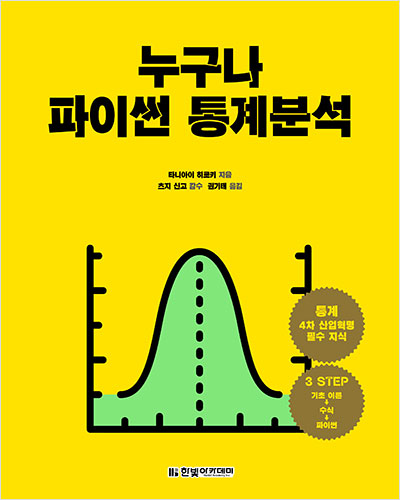

### KDT(Korea Digital Training)- NUMPY

교재 : 누구나 파이썬 통계분석

- 타니아이 히로키,츠지 신고,권기태(한빛 아카데미)  
[교재 사이트](https://www.hanbit.co.kr/store/books/look.php?p_code=B2049588591)  
[교재 코드(Ver.01)](https://www.hanbit.co.kr/support/supplement_list.html) : "누구나 파이썬 통계분석" 검색 -> "소스코드" 클릭  
[교재 코드(Ver.02)](https://github.com/ghmagazine/python_stat_sample)  

<hr/>

#### 개발환경

| 패키지 이름 | 버전   | 사용 커맨드(Version command) |
| ----------- | ------ | ---------------------------- |
| Python      | 3.8.18 | python --version             |
| jupyter     | 1.0.0  | pip show jupyter             |
| ipython     | 8.12.2 | pip show ipython             |
| notebook    | 7.0.6  | pip show notebook            |
| numpy       | 1.24.3 | pip show numpy               |
| pandas      | 2.0.3  | pip show pandas              |
| matplotlib  | 3.7.2  | pip show matplotlib          |
| statsmodels | 0.14.0 | pip show statsmodels         |

<hr/>

#### 이슈사항

```
p.31
[교재 내 코드]pd.set_option('precision', 3)
[수정 코드]pd.set_option('display.precision', 3)
```

<hr/>   
   
|날짜(Date) | 제목 | 네이버 블로그 | 관련 디렉토리 |
| --------  | ---  | -----------| ------------|
| 23.02.16  | numpy,set_option, mean,sort,median,var,square,sqrt,std,ddof  | [Naver Blog](https://blog.naver.com/mathnoah/223355550422)         | Source/notebook/chap01,chap02.ipynb   |
| 23.02.16  | 데이터 정규화, 히스토그램, 상자그림, cumsum, linspace,arange,ones_like,zeros,ones,hitogram | [Naver Blog](https://blog.naver.com/mathnoah/223355691981)         | Source/notebook/chap02.ipynb   |
| 23.02.19  | 2차원 데이터 정리,numpy, 공분산, 상관계수, 앤스컴, 히트맵, 회귀직선, hist2d, colorbar, corr, poly1d, polyfit,cov, corrcoef | [Naver Blog](https://blog.naver.com/mathnoah/223358054171)         | Source/notebook/chap03.ipynb   |
| 23.02.19 |추측통계의 기본 : np.random, 무작위추출, vlines, xlim, query, hlines | [Naver Blog](https://blog.naver.com/mathnoah/223358227791) | Source/notebook/chap04.ipynb |
| 23.02.19 | 이산형 확률변수,확률의 성질,누적분포함수,확률변수의 변환,1차원 이산형 확률변수의 지표,2차원 이산형 확률변수,주변확률분포,2차원 이산형 확률변수 지표| [Naver Blog](https://blog.naver.com/mathnoah/223358353805) | Source/notebook/chap05.ipynb |
| 23.02.20 |이산형 확률분포 : 베르누이 분포, 이항분포, 기하분포, 포아송 분포,scipy,stats,bernoulli,pmf,cdf,comb,binom,geom,poisson | [Naver Blog](https://blog.naver.com/mathnoah/223359288510) | Source/notebook/chap06.ipynb |
| 23.02.20 | 연속형 확률변수:1차원 확률변수, 2차원 확률변수, scipy, integrate, quad, scipy.optimize, minimize_scalar, nquad, partial| [Naver Blog](https://blog.naver.com/mathnoah/223359449665) | Source/notebook/chap07.ipynb |
| 23.02.21 |연속형 확률분포:정규분포,지수분포,카이제곱분포,t분포,F분포, norm, chi2,t,f,rvs,expon,pdf,cdf,isf,interval,lam,mu,sigma | [Naver Blog](https://blog.naver.com/mathnoah/223360326566) | Source/notebook/chap08.ipynb |

### 목차

<details>
  <summary>
    펼쳐보기
  </summary>
  
  - 1장 데이터   
  - 1.1 데이터의 크기   
  - 1.2 변수의 종류   
    - 1.2.1 질적 변수와 양적 변수   
    - 1.2.2 척도 수준   
    - 1.2.3 이산형 변수와 연속형 변수   
- 2장 1차원 데이터 정리   
  - 2.1 데이터 중심의 지표
    - 2.1.1 평균값
    - 2.1.2 중앙값
    - 2.1.3 최빈값
  - 2.2 데이터의 산포도 지표
    - 2.2.1 분산과 표준편차
    - 2.2.2 범위와 사분위 범위
    - 2.2.3 데이터의 지표 정리
  - 2.3 데이터의 정규화
    - 2.3.1 표준화
    - 2.3.2 편찻값
  - 2.4 1차원 데이터의 시각화
    - 2.4.1 도수분포표
    - 2.4.2 히스토그램
    - 2.4.3 상자그림
- 3장 2차원 데이터 정리
  - 3.1 두 데이터 사이의 관계를 나타내는 지표
    - 3.1.1 공분산
    - 3.1.2 상관계수
  - 3.2 2차원 데이터의 시각화
    - 3.2.1 산점도
    - 3.2.2 회귀직선
    - 3.2.3 히트맵
  - 3.3 앤스컴의 예
- 4장 추측통계의 기본
  - 4.1 모집단과 표본
    - 4.1.1 표본추출 방법
  - 4.2 확률 모형
    - 4.2.1 확률의 기본
    - 4.2.2 확률분포
  - 4.3 추측통계의 확률
  - 4.4 이제부터 배울 내용
- 5장 이산형 확률변수
  - 5.1 1차원 이산형 확률변수
    - 5.1.1 1차원 이산형 확률변수의 정의
    - 5.1.2 1차원 이산형 확률변수의 지표
  - 5.2 2차원 이산형 확률변수
    - 5.2.1 2차원 이산형 확률변수의 정의
    - 5.2.2 2차원 이산형 확률변수의 지표
- 6장 대표적인 이산형 확률분포
  - 6.1 베르누이 분포
  - 6.2 이항분포
  - 6.3 기하분포
  - 6.4 포아송 분포
- 7장 연속형 확률변수
  - 7.1 1차원 연속형 확률변수
    - 7.1.1 1차원 연속형 확률변수의 정의
    - 7.1.2 1차원 연속형 확률변수의 지표
  - 7.2 2차원 연속형 확률변수
    - 7.2.1 2차원 연속형 확률변수의 정의
    - 7.2.2 2차원 연속형 확률변수의 지표
- 8장 대표적인 연속형 확률분포
  - 8.1 정규분포
  - 8.2 지수분포
  - 8.3 카이제곱분포
  - 8.4 t 분포
  - 8.5 F 분포
- 9장 독립동일분포
  - 9.1 독립성
    - 9.1.1 독립성의 정의
    - 9.1.2 독립성과 무상관성
  - 9.2 합의 분포
    - 9.2.1 정규분포의 합의 분포
    - 9.2.2 포아송 분포의 합의 분포
    - 9.2.3 베르누이 분포의 합의 분포
  - 9.3 표본평균의 분포
    - 9.3.1 정규분포의 표본평균 분포
    - 9.3.2 포아송 분포의 표본평균 분포
    - 9.3.3 중심극한정리
    - 9.3.4 대수의 법칙
- 10장 통계적 추정
  - 10.1 점추정
    - 10.1.1 모평균의 점추정
    - 10.1.2 모분산의 점추정
    - 10.1.3 정리
  - 10.2 구간추정
    - 10.2.1 정규분포의 모평균 구간추정 : 모분산을 알고 있는 경우
    - 10.2.2 정규분포의 모분산 구간추정
    - 10.2.3 정규분포의 모평균 구간추정 : 모분산을 모르는 경우
    - 10.2.4 베르누이 분포의 모평균 구간추정
    - 10.2.5 포아송 분포의 모평균 신뢰구간
- 11장 통계적 가설검정
  - 11.1 통계적 가설검정
    - 11.1.1 통계적 가설검정의 기본
    - 11.1.2 단측검정과 양측검정
    - 11.1.3 가설검정의 두 가지 오류
  - 11.2 기본적인 가설검정
    - 11.2.1 정규분포의 모평균에 대한 검정 : 모분산을 알고 있는 경우
    - 11.2.2 정규분포의 모분산에 대한 검정
    - 11.2.3 정규분포의 모평균에 대한 검정 : 모분산을 모르는 경우
  - 11.3 2표본 문제에 관한 가설검정
    - 11.3.1 대응비교 t 검정
    - 11.3.2 독립비교 t 검정
    - 11.3.3 윌콕슨의 부호순위검정
    - 11.3.4 만∙위트니의 U 검정
    - 11.3.5 카이제곱검정
- 12장 회귀분석
  - 12.1 단순회귀모형
    - 12.1.1 회귀분석에서의 가설
    - 12.1.2 statsmodels에 의한 회귀분석
    - 12.1.3 회귀계수
  - 12.2 중회귀모형
    - 12.2.1 회귀계수
    - 12.2.2 가변수
  - 12.3 모형의 선택
    - 12.3.1 결정계수
    - 12.3.2 조정결정계수
    - 12.3.3 F 검정
    - 12.3.4 최대로그우도와 AIC
  - 12.4 모형의 타당성
    - 12.4.1 정규성 검정
    - 12.4.2 더빈-왓슨비
    - 12.4.3 다중공선성
</details>

</div>
